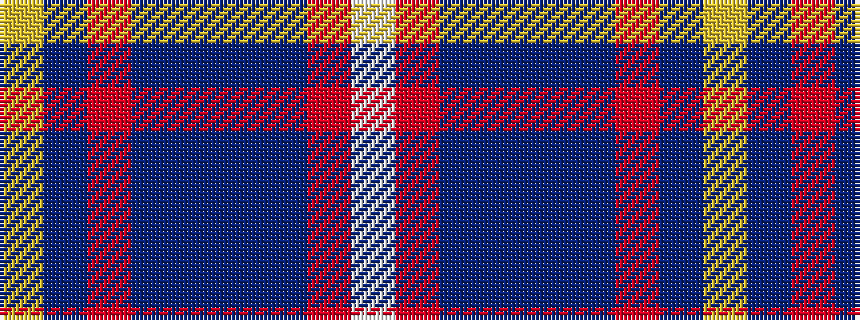

WRBBBBRBY

It is a 9 stripe tartan.

<figure class="pat-woven">

<figcaption>idealised sample</figcaption>
</figure>

## Colour Sequence



## Tartans with this colour sequence

| Tartans |
|---------------|
| [Royal Scottish Corporation](/setts/s9/w2r3db12db3db3db28r3db3ly2~x2/)|
||
