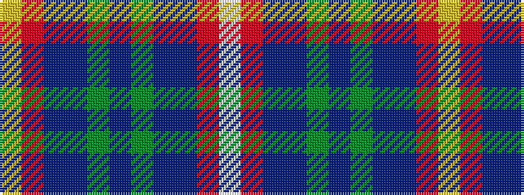

WRBBGBGBBRY

It is a 11 stripe tartan.

<figure class="pat-woven">

<figcaption>idealised sample</figcaption>
</figure>

## Colour Sequence



## Tartans with this colour sequence

| Tartans |
|---------------|
| [McMurchie Family, John and Jessie (Personal)](/variants/s11/ly1r13db6n7g2n7g2n7db6r13lb1~x2/)|
||
