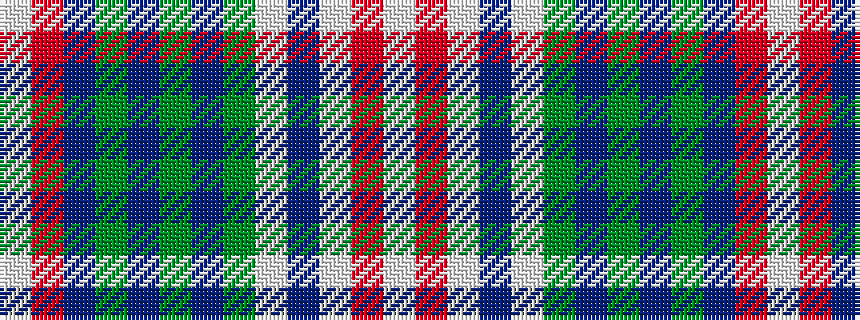

WRBGBGBGWBWRW

It is a 13 stripe tartan.

<figure class="pat-woven">

<figcaption>idealised sample</figcaption>
</figure>

## Colour Sequence



## Tartans with this colour sequence

| Tartans |
|---------------|
| [Largs Dress District Tartan Tartan Number: 1838. Earliest known date: 1983 The Largs tartan is a new design created for the town and officially adopted in 1981. There is also a dress version. See products available Copyright © Blair Urquhart, Comrie, 2015](/setts/s13/w4r21db4dy16db4dy8db4dy4w3db6w49r3w4/)|
||
