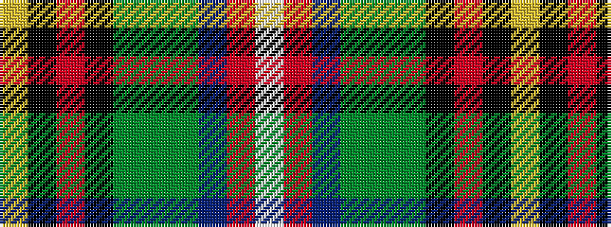

WRBGGGKRKY

It is a 10 stripe tartan.

<figure class="pat-woven">

<figcaption>idealised sample</figcaption>
</figure>

## Colour Sequence



## Tartans with this colour sequence

| Tartans |
|---------------|
| [Essex County (Ontario)](/setts/s10/ly30k1r4k1g3dg5dg4t6r2lb2~x2/)|
||
| [Essex, County Ontario](/setts/s10/ly30k1r4k1g3g5dg4t6r2w2~x2/)|
||
