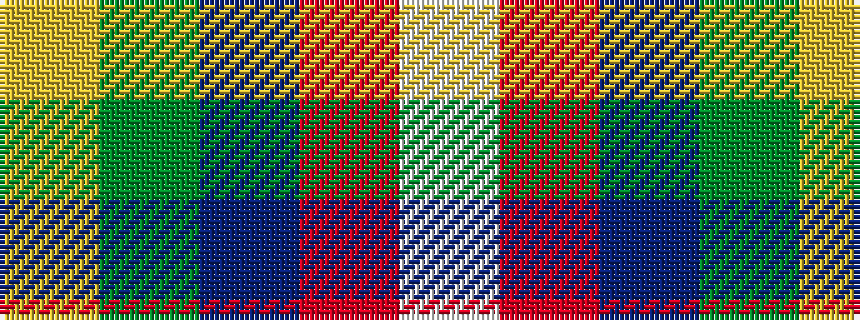

WRBGY

It is a 5 stripe tartan.

<figure class="pat-woven">

<figcaption>idealised sample</figcaption>
</figure>

## Colour Sequence



## Tartans with this colour sequence

| Tartans |
|---------------|
| [McGill University](/variants/s5/w3r24db12dg8ly3~x2/)|
||
| [McGill University (Corporate)](/variants/s5/w3r24db12dg8lo3~x2/)|
||
