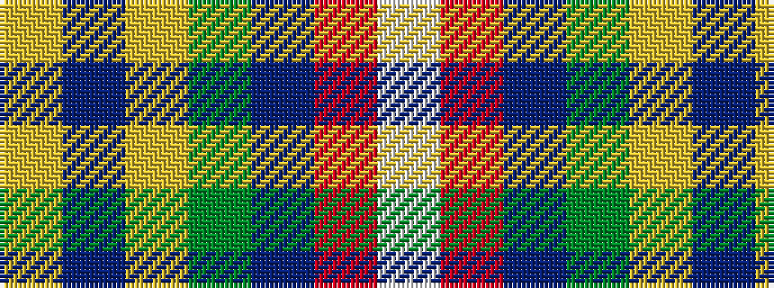

WRBGYBY

It is a 7 stripe tartan.

<figure class="pat-woven">

<figcaption>idealised sample</figcaption>
</figure>

## Colour Sequence



## Tartans with this colour sequence

| Tartans |
|---------------|
| [Caig (Corporate)](/setts/s7/w3r2dp31g30ly2dp2ly1~x2/)|
||
