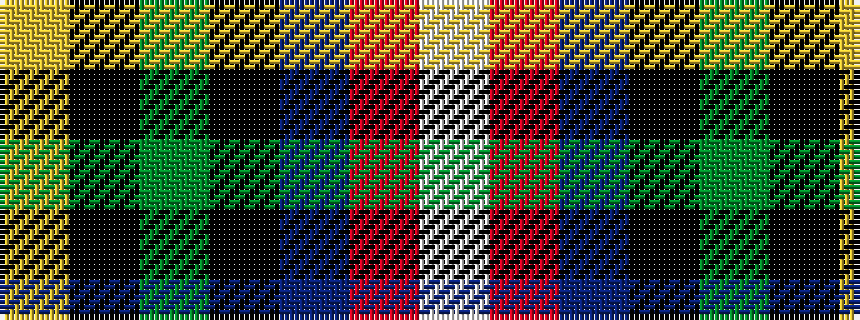

WRBKGKY

It is a 7 stripe tartan.

<figure class="pat-woven">

<figcaption>idealised sample</figcaption>
</figure>

## Colour Sequence



## Tartans with this colour sequence

| Tartans |
|---------------|
| [MacNeil](/setts/s7/ly1k3dg15k14db16r2lb1~x2/)|
||
| [MacNeil - 1840 (Chief's sett)](/setts/s7/w2r3db33k33g33k6ly2~x2/)|
||
| [MacNeil 7](/setts/s7/w1r2db16k14g15k3ly1~x2/)|
||
| [Macneil of Barra - Chief (Personal)](/setts/s7/w1r2b16k14g15k3ly1~x2/)|
||
