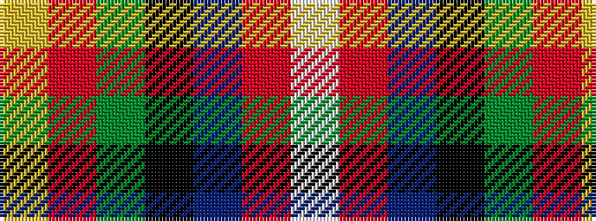

WRBKGRY

It is a 7 stripe tartan.

<figure class="pat-woven">

<figcaption>idealised sample</figcaption>
</figure>

## Colour Sequence



## Tartans with this colour sequence

| Tartans |
|---------------|
| [Council of Scottish Clans & Ass. (Co](/setts/s7/w2r2db16k14g15r2ly2~x2/)|
||
