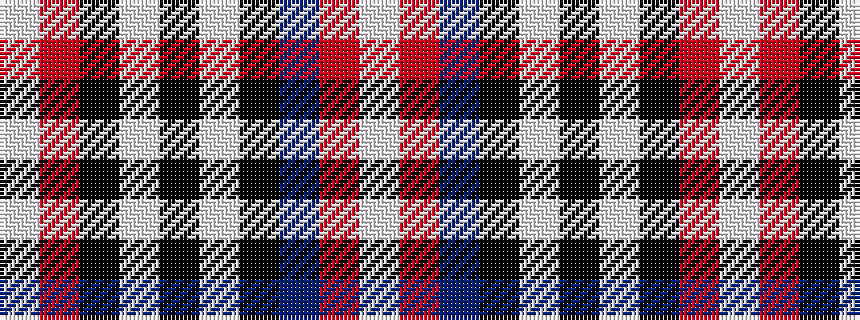

WRBKWKWKRW

It is a 10 stripe tartan.

<figure class="pat-woven">

<figcaption>idealised sample</figcaption>
</figure>

## Colour Sequence



## Tartans with this colour sequence

| Tartans |
|---------------|
| [Naysmith, William A (Personal)](/variants/s10/lb4r2db14k4lb4k3lb3k2r2lbi2~x2/)|
||
