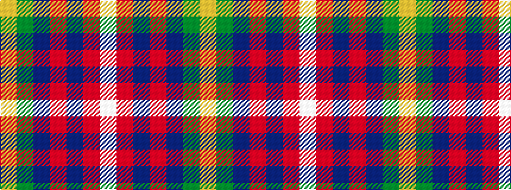

WRBRBGY

It is a 7 stripe tartan.

<figure class="pat-woven">

<figcaption>idealised sample</figcaption>
</figure>

## Colour Sequence



## Tartans with this colour sequence

| Tartans |
|---------------|
| [Bathija (Name)](/variants/s7/ly4g18b4ri8b8r21w1~x2/)|
||
| [Feis An Eilein (Corporate)](/variants/s7/ly2g2db8ri4db8r9lb2~x4/)|
||
| [G P Bathija (Shikarpur, Sindh)](/variants/s7/ly4dg18db4o8db8r21w1~x2/)|
||
| [G P Bathija (Shikarpur, Sindh) Name Tartan](/variants/s7/ly4g18t4o8t8r21w1~x2/)|
||
