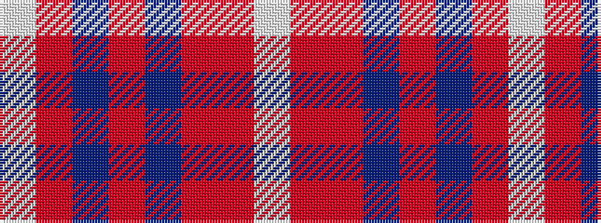

WRBRBRRW

It is a 8 stripe tartan.

<figure class="pat-woven">

<figcaption>idealised sample</figcaption>
</figure>

## Colour Sequence



## Tartans with this colour sequence

| Tartans |
|---------------|
| [Tenmaya Check](/variants/s8/lb1o12r1dt1r1dt2r5lb1~x4/)|
||
