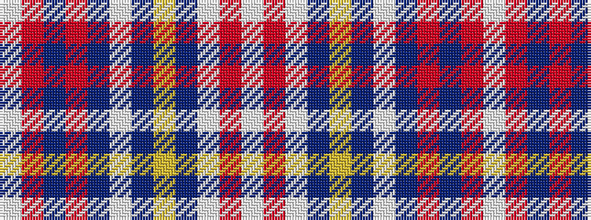

WRBRBWBYBWRW

It is a 12 stripe tartan.

<figure class="pat-woven">

<figcaption>idealised sample</figcaption>
</figure>

## Colour Sequence



## Tartans with this colour sequence

| Tartans |
|---------------|
| [Diana, Plaid dress](/setts/s12/w46r3w7dr2ly2dr2w2dr11o6b2o3w2~x2/)|
||
