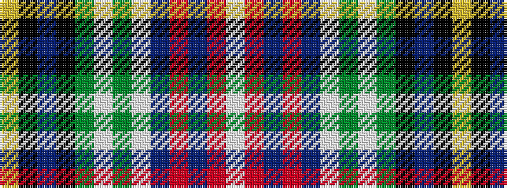

WRBRBWGWGKBKY

It is a 13 stripe tartan.

<figure class="pat-woven">

<figcaption>idealised sample</figcaption>
</figure>

## Colour Sequence



## Tartans with this colour sequence

| Tartans |
|---------------|
| [Stanners (Personal)](/variants/s13/lr4k4dt4k4g4w1g4w1dt3r4dt3r4w1~x4/)|
||
| [Stanners (Personal)](/variants/s13/lr4k4n4k4g4w1g4w1n3r4n3r4w1~x4/)|
||
