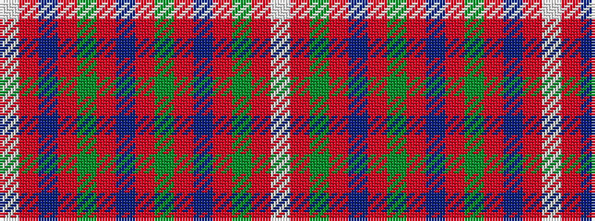

WRBRGRBRGRBRGRW

It is a 15 stripe tartan.

<figure class="pat-woven">

<figcaption>idealised sample</figcaption>
</figure>

## Colour Sequence



## Tartans with this colour sequence

| Tartans |
|---------------|
| [MacIntyre](/setts/s15/lb1r2dg2r4db16r2dg1r4db1r2dg16r4db2r2lb1~x2/)|
||
