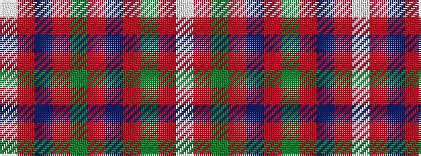

WRBRGRBRGRW

It is a 11 stripe tartan.

<figure class="pat-woven">

<figcaption>idealised sample</figcaption>
</figure>

## Colour Sequence



## Tartans with this colour sequence

| Tartans |
|---------------|
| [MacKinnon #10](/variants/s11/w2r4dg8r16t2r3dg16r4t2r4w2~x2/)|
||
| [MacKinnon 7](/variants/s11/w2r4g8r16t2r3g16r4t2r4w2~x2/)|
||
