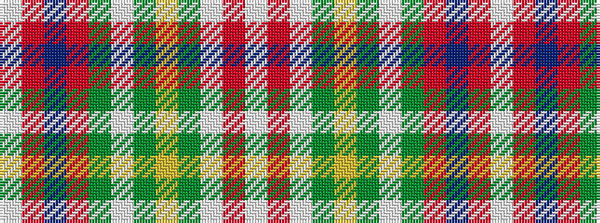

WRBRGWGYGWRW

It is a 12 stripe tartan.

<figure class="pat-woven">

<figcaption>idealised sample</figcaption>
</figure>

## Colour Sequence



## Tartans with this colour sequence

| Tartans |
|---------------|
| [Unidentified #54](/setts/s12/lb24r2lb3dy1ly1dy1lb1dy6o6b1o2lb1~x4/)|
||
