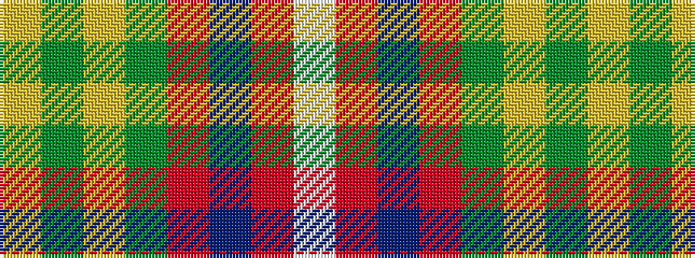

WRBRGYGY

It is a 8 stripe tartan.

<figure class="pat-woven">

<figcaption>idealised sample</figcaption>
</figure>

## Colour Sequence



## Tartans with this colour sequence

| Tartans |
|---------------|
| [Hall (P.I.E.) (Personal)](/setts/s8/ly5g3ly3g53r7db5r13w4~x2/)|
||
