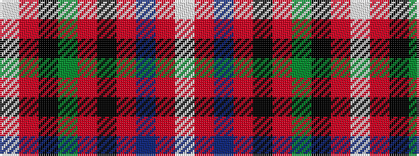

WRBRKRGKRW

It is a 10 stripe tartan.

<figure class="pat-woven">

<figcaption>idealised sample</figcaption>
</figure>

## Colour Sequence



## Tartans with this colour sequence

| Tartans |
|---------------|
| [Unidentified Plaid #7](/setts/s10/w8r100k42dg42r5k3r5t42r100w8/)|
||
| [Unidentified Plaid 10](/setts/s10/w8r100k42g42r5k3r5t42r100w8/)|
||
