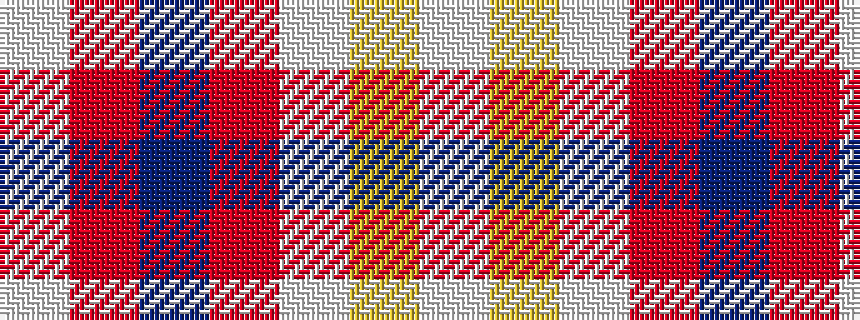

WRBRWYW

It is a 7 stripe tartan.

<figure class="pat-woven">

<figcaption>idealised sample</figcaption>
</figure>

## Colour Sequence



## Tartans with this colour sequence

| Tartans |
|---------------|
| [Banff, White (Fashion)](/setts/s7/w8ly3w22o22dr3r2w4~x2/)|
||
