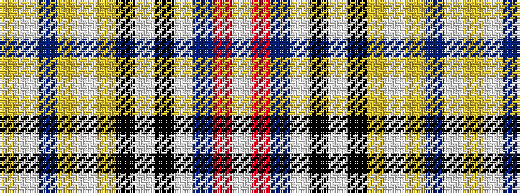

WRBWKWKYWYBWY

It is a 13 stripe tartan.

<figure class="pat-woven">

<figcaption>idealised sample</figcaption>
</figure>

## Colour Sequence



## Tartans with this colour sequence

| Tartans |
|---------------|
| [Robieson Kith & Kin (Personal)](/setts/s13/w1r1b8lb1k1w8k1lo8lb1lo1b8lb1lo1~x6/)|
||
