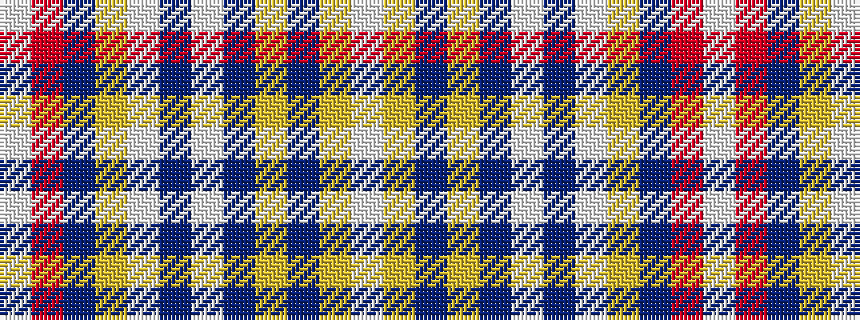

WRBYWBWBYBYW

It is a 12 stripe tartan.

<figure class="pat-woven">

<figcaption>idealised sample</figcaption>
</figure>

## Colour Sequence



## Tartans with this colour sequence

| Tartans |
|---------------|
| [Diana, Plaid Dress](/setts/s12/w46r3do2ly2w7do2w2do11lo6t2lo3w3~x2/)|
||
