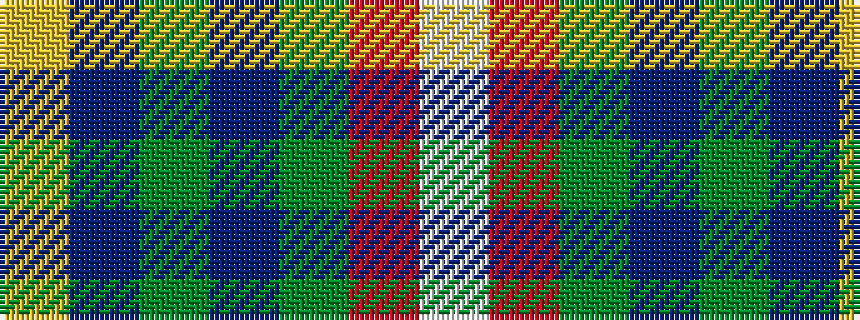

WRGBGBY

It is a 7 stripe tartan.

<figure class="pat-woven">

<figcaption>idealised sample</figcaption>
</figure>

## Colour Sequence



## Tartans with this colour sequence

| Tartans |
|---------------|
| [Blairgowrie Golf Club, The](/variants/s7/w3r5g5dp4dg7db38lo3~x2/)|
||
