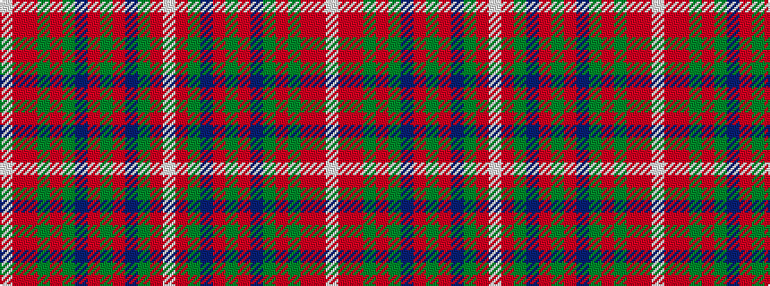

WRGBRGRBGRGRRW

It is a 14 stripe tartan.

<figure class="pat-woven">

<figcaption>idealised sample</figcaption>
</figure>

## Colour Sequence



## Tartans with this colour sequence

| Tartans |
|---------------|
| [MacKinnon #11](/variants/s14/w3r5dg3dp3r14dg36r3dp8dg3r36dg14ri3r5w3~x2/)|
||
| [MacKinnon 3](/variants/s14/w3ri5r3g14ri36g3p8ri3g36ri14p3g3ri5w3~x2/)|
||
