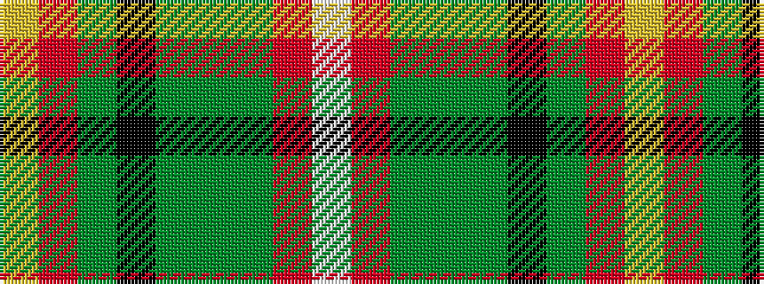

WRGGGKGRY

It is a 9 stripe tartan.

<figure class="pat-woven">

<figcaption>idealised sample</figcaption>
</figure>

## Colour Sequence



## Tartans with this colour sequence

| Tartans |
|---------------|
| [Virginia Military Institute, New Market](/variants/s9/w6r25y2g3y30k3y2r30ly6~x2/)|
||
