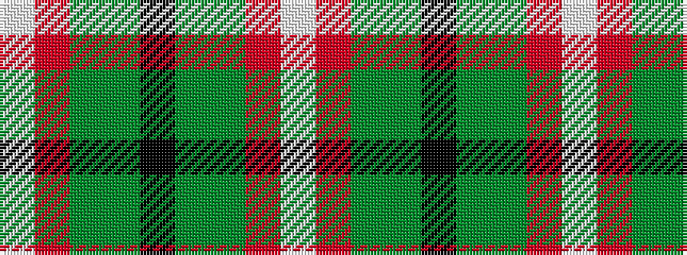

WRGGKGGRW

It is a 9 stripe tartan.

<figure class="pat-woven">

<figcaption>idealised sample</figcaption>
</figure>

## Colour Sequence



## Tartans with this colour sequence

| Tartans |
|---------------|
| [Wynberg Boys' High School](/variants/s9/w4r13g54dg22k4y20g48r13w4/)|
||
