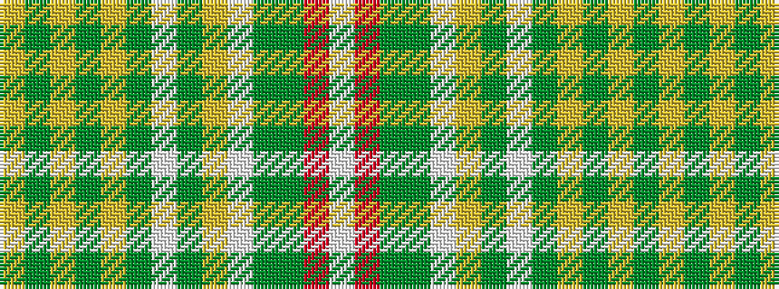

WRGGWYGWGYGYGY

It is a 14 stripe tartan.

<figure class="pat-woven">

<figcaption>idealised sample</figcaption>
</figure>

## Colour Sequence



## Tartans with this colour sequence

| Tartans |
|---------------|
| [Malone, Keagan Allen (Personal)](/variants/s14/lr2g3lr2g12lo5g12w1dg16lo3w3g3dg2o2w1~x2/)|
||
