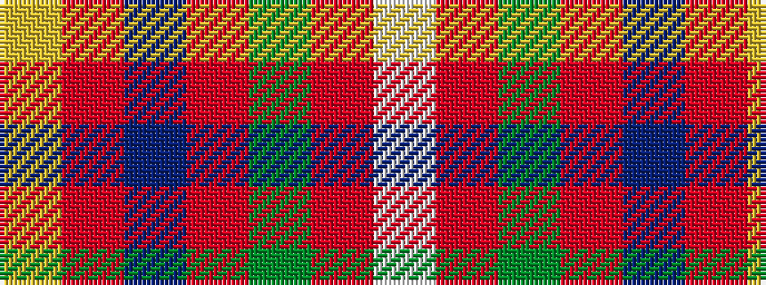

WRGRBRY

It is a 7 stripe tartan.

<figure class="pat-woven">

<figcaption>idealised sample</figcaption>
</figure>

## Colour Sequence



## Tartans with this colour sequence

| Tartans |
|---------------|
| [Pubcrawlers, The](/setts/s7/w3o4dg2o22dt5o16ly3~x2/)|
||
