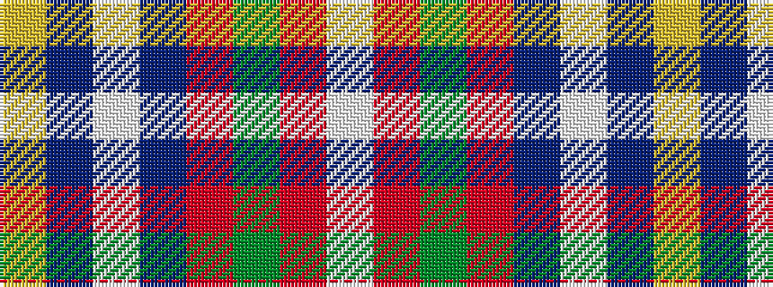

WRGRBWBY

It is a 8 stripe tartan.

<figure class="pat-woven">

<figcaption>idealised sample</figcaption>
</figure>

## Colour Sequence



## Tartans with this colour sequence

| Tartans |
|---------------|
| [Manitoba Masonic](/setts/s8/ly3n8w3n34r34g4r4w2~x2/)|
||
| [Manitoba Masonic (Corporate)](/setts/s8/ly3db8w3db34r34g4r4w2~x2/)|
||
