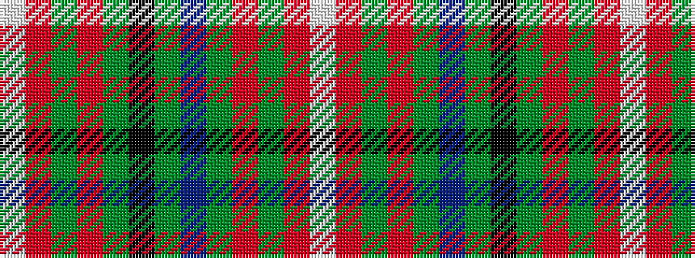

WRGRGBGKGRGRW

It is a 13 stripe tartan.

<figure class="pat-woven">

<figcaption>idealised sample</figcaption>
</figure>

## Colour Sequence



## Tartans with this colour sequence

| Tartans |
|---------------|
| [Reid, Green](/setts/w1r2g10r2g2k8g2db8g2r2g10r2w1/)|
||
