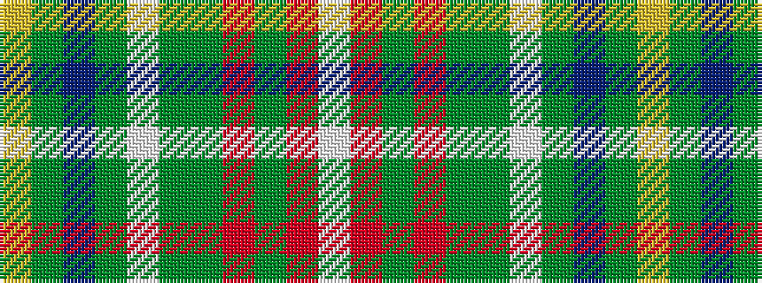

WRGRGGWGBGY

It is a 11 stripe tartan.

<figure class="pat-woven">

<figcaption>idealised sample</figcaption>
</figure>

## Colour Sequence



## Tartans with this colour sequence

| Tartans |
|---------------|
| [Unidentified (Possibly Muirhead)](/variants/s11/ly3dy24db4dy8w2dy2dg10r12dyi2r5w2~x2/)|
||
