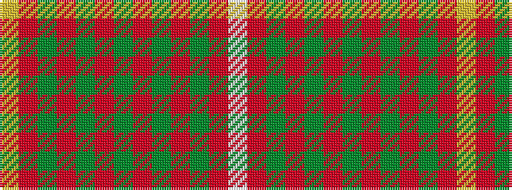

WRGRGRGRGRGRY

It is a 13 stripe tartan.

<figure class="pat-woven">

<figcaption>idealised sample</figcaption>
</figure>

## Colour Sequence



## Tartans with this colour sequence

| Tartans |
|---------------|
| [Glencross (Haverlands House) (Personal)](/variants/s13/w3r35y3r2y3r10dg3r2dg3r2dg3r10ly2~x2/)|
||
