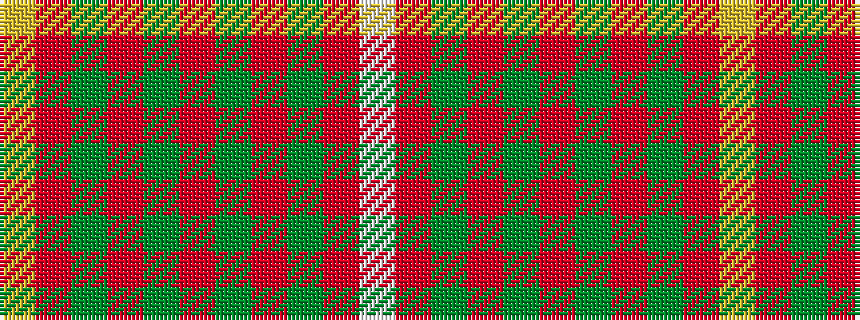

WRGRGRGRGRY

It is a 11 stripe tartan.

<figure class="pat-woven">

<figcaption>idealised sample</figcaption>
</figure>

## Colour Sequence



## Tartans with this colour sequence

| Tartans |
|---------------|
| [Bruce (Vestiarium)](/setts/s11/w1r8g2r2g6r1g6r2g2r8ly1~x4/)|
||
