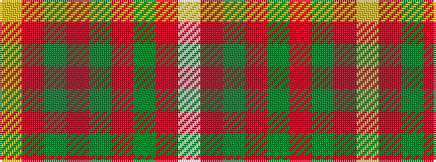

WRGRGRGRY

It is a 9 stripe tartan.

<figure class="pat-woven">

<figcaption>idealised sample</figcaption>
</figure>

## Colour Sequence



## Tartans with this colour sequence

| Tartans |
|---------------|
| [MacFie](/variants/s9/ly1r12dg2r1dg16r1dg2r12lb1/)|
||
| [MacPhie/Macfie](/setts/w1r12g2r1g16r1g2r12ly1/)|
||
