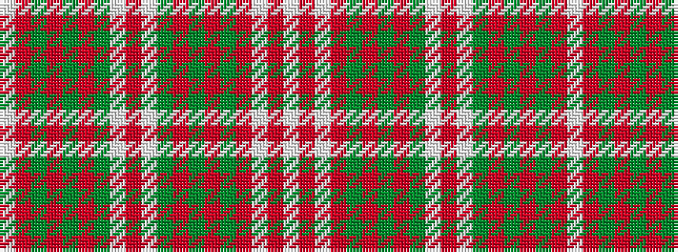

WRGRGRGWRWGRGRGRWRW

It is a 19 stripe tartan.

<figure class="pat-woven">

<figcaption>idealised sample</figcaption>
</figure>

## Colour Sequence



## Tartans with this colour sequence

| Tartans |
|---------------|
| [MacDougall (Lochcarron)](/variants/s19/w6r2g16r3g2r3g6w2r2w2g6r7g6r2g2r16w2r2w2~x2/)|
||
