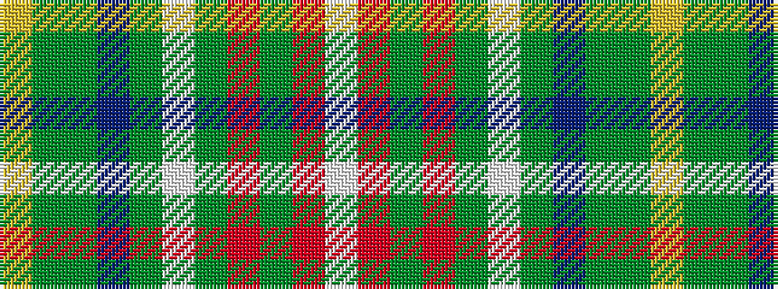

WRGRGWGBGGY

It is a 11 stripe tartan.

<figure class="pat-woven">

<figcaption>idealised sample</figcaption>
</figure>

## Colour Sequence



## Tartans with this colour sequence

| Tartans |
|---------------|
| [Muirhead (Clan)](/setts/s11/ly3gi14g9db4g8w2g12r12g2r5w2~x2/)|
||
