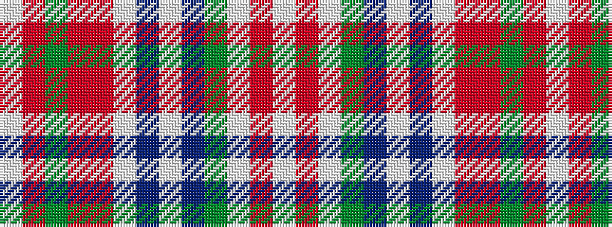

WRGRRWBWBGWRW

It is a 13 stripe tartan.

<figure class="pat-woven">

<figcaption>idealised sample</figcaption>
</figure>

## Colour Sequence



## Tartans with this colour sequence

| Tartans |
|---------------|
| [Grant of Acharrow](/setts/s13/w6r2w38g8db6w2db2w2o14r7g2r3w2~x2/)|
||
