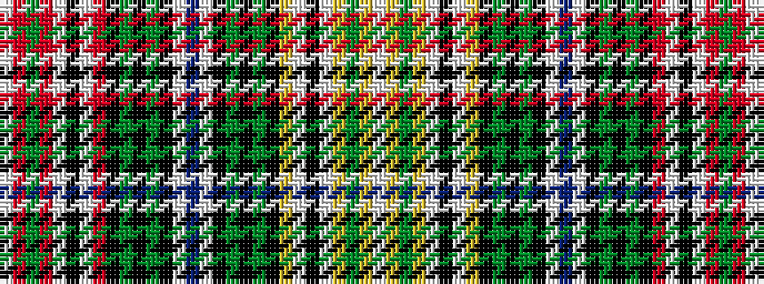

WRGRWKWRKGKGKWBWKGKGKYWKWYGYW

It is a 29 stripe tartan.

<figure class="pat-woven">

<figcaption>idealised sample</figcaption>
</figure>

## Colour Sequence



## Tartans with this colour sequence

| Tartans |
|---------------|
| [Glassary (Initial)](/variants/s29/w2r2g3r6w1k1w1r6k1g3k1dy4k1w1t2w1k1dy4k1g3k1ly6w1k1w1ly6g3ly2w2~x2/)|
||
