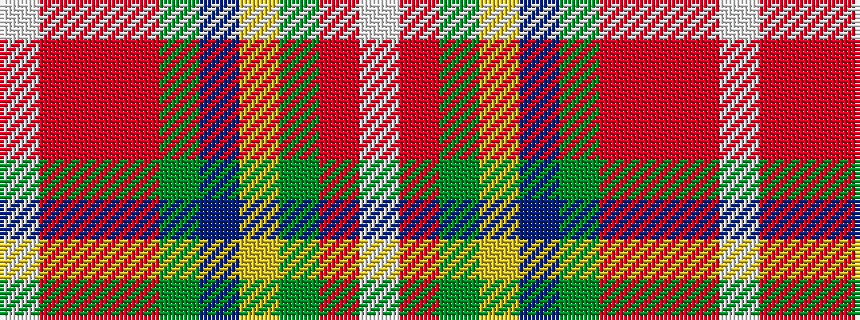

WRGYBGRRRW

It is a 10 stripe tartan.

<figure class="pat-woven">

<figcaption>idealised sample</figcaption>
</figure>

## Colour Sequence



## Tartans with this colour sequence

| Tartans |
|---------------|
| [Unidentified Silk scarf](/variants/s10/w3r10dy6ly8t8dg32ri8r10ri6w3~x4/)|
||
