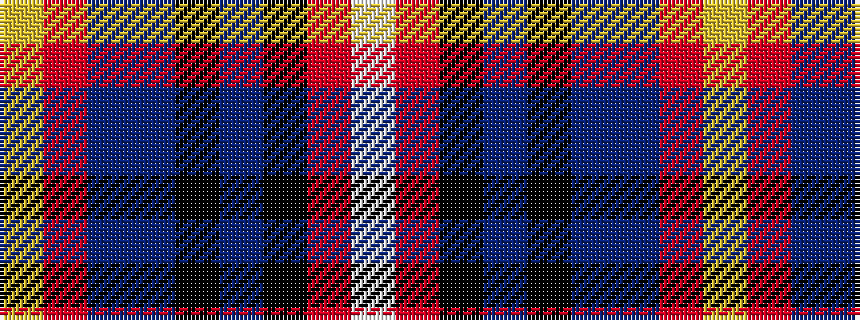

WRKBKBBRY

It is a 9 stripe tartan.

<figure class="pat-woven">

<figcaption>idealised sample</figcaption>
</figure>

## Colour Sequence



## Tartans with this colour sequence

| Tartans |
|---------------|
| [East Kilbride #2](/variants/s9/w2r14k1n5k1n5do8r10lo2~x4/)|
||
