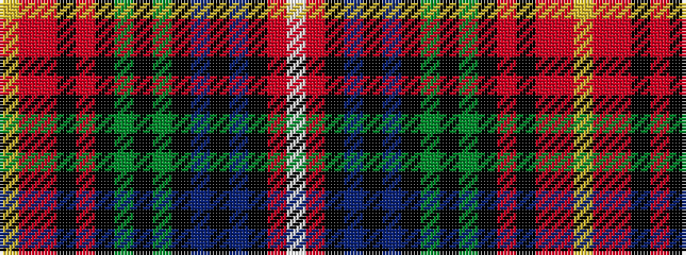

WRKBKBKGKGKRKRRY

It is a 16 stripe tartan.

<figure class="pat-woven">

<figcaption>idealised sample</figcaption>
</figure>

## Colour Sequence



## Tartans with this colour sequence

| Tartans |
|---------------|
| [Muzzi, Massimiliano Baron of Striche](/variants/s16/ly2o1r19k2r8k3g9k3g6k2db6k1db5k2r27w1~x2/)|
||
