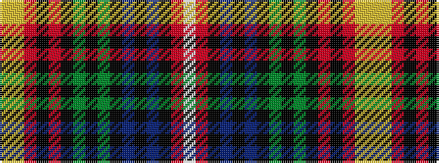

WRKBKBKGKGKRKRYY

It is a 16 stripe tartan.

<figure class="pat-woven">

<figcaption>idealised sample</figcaption>
</figure>

## Colour Sequence



## Tartans with this colour sequence

| Tartans |
|---------------|
| [Muzzi, Massimiliano, baron of Strichen Dress (Personal)](/setts/s16/ly2lr1r19k2r8k3dg9k3dg6k2db6k1db5k2r27w1~x2/)|
||
