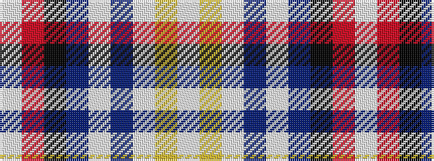

WRKBWBWYW

It is a 9 stripe tartan.

<figure class="pat-woven">

<figcaption>idealised sample</figcaption>
</figure>

## Colour Sequence



## Tartans with this colour sequence

| Tartans |
|---------------|
| [Wrens (WRNS) (Military)](/setts/s9/lb16ly3lb9b14lb1b8k32r1w4~x2/)|
||
