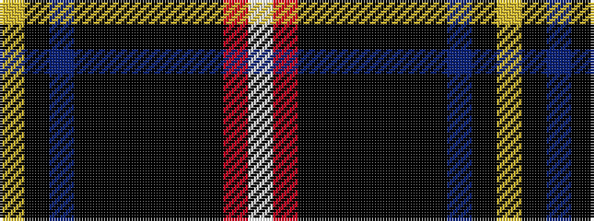

WRKKKKKKBKY

It is a 11 stripe tartan.

<figure class="pat-woven">

<figcaption>idealised sample</figcaption>
</figure>

## Colour Sequence



## Tartans with this colour sequence

| Tartans |
|---------------|
| [Correctional Service Canada](/variants/s11/ly4k5b2k30ki1k4ki4k1ki15r6w3~x2/)|
||
