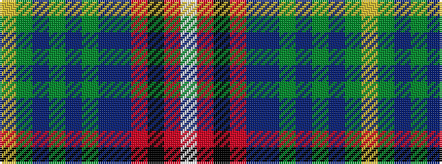

WRKRBBGBGBGY

It is a 12 stripe tartan.

<figure class="pat-woven">

<figcaption>idealised sample</figcaption>
</figure>

## Colour Sequence



## Tartans with this colour sequence

| Tartans |
|---------------|
| [Chattahoochee Commemorative Tartan](/variants/s12/w4r4k4r15dbi12db12dg6db4dg4db4dg19ly4/)|
||
| [Chattahoochee River](/variants/s12/w3r3k3r10b7db8g4db3g3db3g13lo3~x2/)|
||
