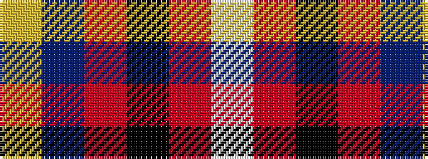

WRKRBY

It is a 6 stripe tartan.

<figure class="pat-woven">

<figcaption>idealised sample</figcaption>
</figure>

## Colour Sequence



## Tartans with this colour sequence

| Tartans |
|---------------|
| [Lord's Own Highlanders (Corporate)](/variants/s6/w5o20k8r5dp36lo5~x2/)|
||
