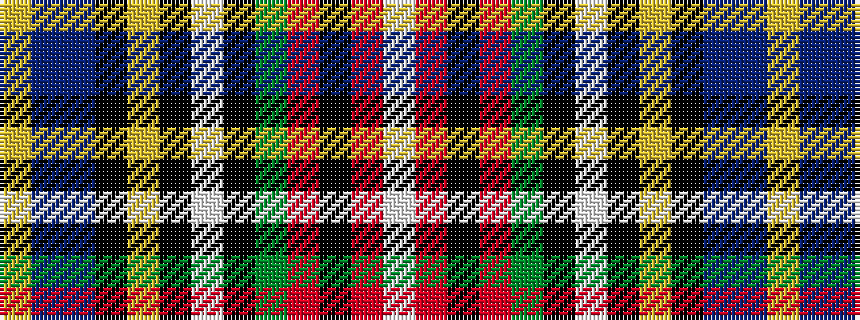

WRKRGKWKYKBBY

It is a 13 stripe tartan.

<figure class="pat-woven">

<figcaption>idealised sample</figcaption>
</figure>

## Colour Sequence



## Tartans with this colour sequence

| Tartans |
|---------------|
| [Cree](/variants/s13/w3r3k3r5g7k2w3k2ly3k7db2dr22ly3~x2/)|
||
| [Cree Clan Tartan](/variants/s13/w3r3k3r5g7k2w3k2ly3k7db2do22ly3~x2/)|
||
