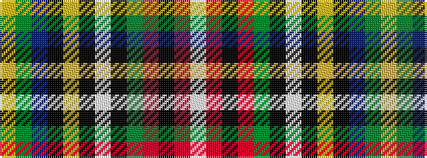

WRKRGKWKYKBGY

It is a 13 stripe tartan.

<figure class="pat-woven">

<figcaption>idealised sample</figcaption>
</figure>

## Colour Sequence



## Tartans with this colour sequence

| Tartans |
|---------------|
| [Cree](/variants/s13/ly30dy20db2k6ly3k2w3k2g6r6k3r3w3~x2/)|
||
| [Cree (Fashion)](/variants/s13/w3r3k3r6g6k2w3k2ly3k6db2dy20ly3~x2/)|
||
