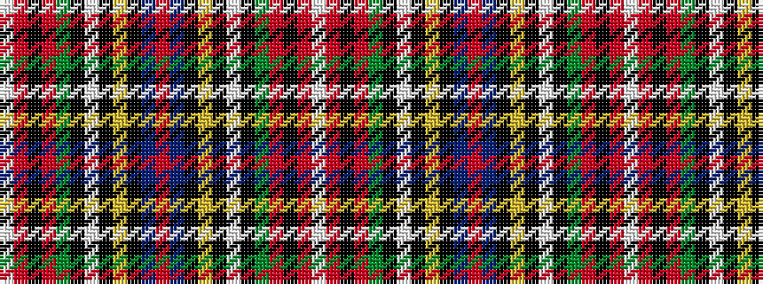

WRKRGKWKYKBRBKYKWKGRKRW

It is a 23 stripe tartan.

<figure class="pat-woven">

<figcaption>idealised sample</figcaption>
</figure>

## Colour Sequence



## Tartans with this colour sequence

| Tartans |
|---------------|
| [Stewart](/variants/s23/w2r3k2r8g16k2w2k2ly1k10t6r32t6k10ly1k2w2k2g16r8k2r3w1~x4/)|
||
