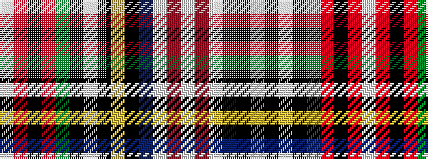

WRKRGKWKYKBWRW

It is a 14 stripe tartan.

<figure class="pat-woven">

<figcaption>idealised sample</figcaption>
</figure>

## Colour Sequence



## Tartans with this colour sequence

| Tartans |
|---------------|
| [Hay - Stewart (Fashion)](/setts/s14/w9r5w29db3k10ly2k3w3k3dg12r6k3r3w2~x2/)|
||
