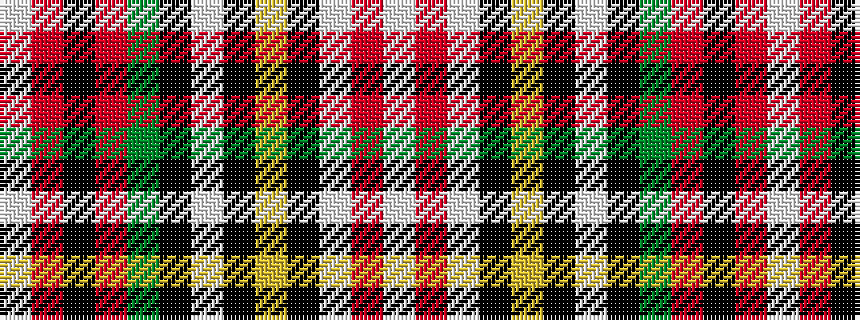

WRKRGKWKYKWRW

It is a 13 stripe tartan.

<figure class="pat-woven">

<figcaption>idealised sample</figcaption>
</figure>

## Colour Sequence



## Tartans with this colour sequence

| Tartans |
|---------------|
| [Hay or Stewart](/setts/s13/w9r5w29k10ly2k3w3k3dg12r6k3r3w2~x2/)|
||
| [Hay, or Stewart](/setts/s13/w9r5w29k10ly2k3w3k3g12r6k3r3w2~x2/)|
||
